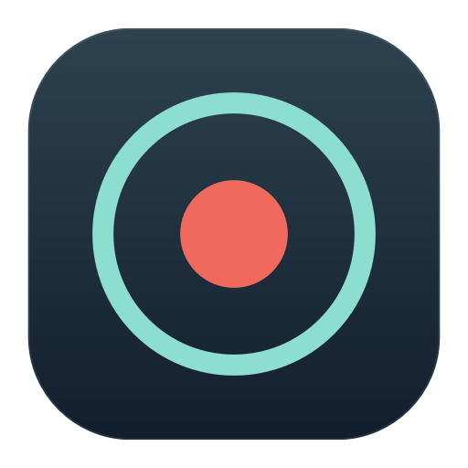

<div align="center">



# Wiretap

**Record everything you hear. Keep everything local.**

[](https://github.com/zaidazmi/wiretap)
[](https://github.com/zaidazmi/wiretap)
[](LICENSE)
[](https://github.com/zaidazmi/wiretap/actions/workflows/ci.yml)

A macOS menu bar app that captures your system audio and microphone into a single `.m4a` file.
Zero dependencies, zero cloud, zero accounts.

</div>

---

Hit record before a Zoom call, a YouTube rabbit hole, or a three-hour podcast. Wiretap captures both sides of the conversation, mixes them together, and drops the file in a searchable library on your Mac.

## Why

Most of what I learn comes through audio. Meetings, lectures, long YouTube breakdowns. The problem is it all disappears the moment it ends. Wiretap gives me a file I can keep, transcribe later, or feed into whatever tool I want.

Nothing leaves your Mac. The recordings sit on your disk, and what you do with them after that is your call.

## How it works

Wiretap grabs system audio through ScreenCaptureKit (no virtual audio driver to install) and records the physical default microphone at the same time. When you're on speakers, it keeps the live capture pinned to that physical device and applies voice isolation during finalization, so VoiceChat apps cannot silently replace or stop the microphone graph. On headphones or Bluetooth, it skips the processing and captures raw. During the final mix, microphone audio receives a dedicated gain boost while system audio stays at its captured level, with peak limiting to prevent clipping.

Default input and output changes are handled while recording. Output switches leave capture running, and microphone switches rebind the live writer to the new default device while preserving the recording timeline.

You can start and stop from the menu bar or hit `Cmd+Shift+R` from anywhere. After you stop, the library shows a saving state while it creates the final file. Recordings go into a built-in library where you can play them back at 1×, 1.1×, 1.24×, 1.5×, or 2× speed, search, rename, export, or share. If your Mac sleeps mid-recording or the app gets killed, the next launch recovers what it can.

The whole project is pure Swift with zero external dependencies. Builds from source with one command.

## Build from source

```sh
swift run Wiretap          # run from source
Scripts/build-app.sh debug # or build a proper .app
```

Requires macOS 15+ and will ask for Microphone and Screen Recording permissions on first run.

## Build a DMG

```sh
Scripts/package-dmg.sh debug
```

See the [release docs](Scripts/README.md) for signing, notarization, and CI details.

## Tests

```sh
swift test
```

## License

MIT. See [LICENSE](LICENSE).
